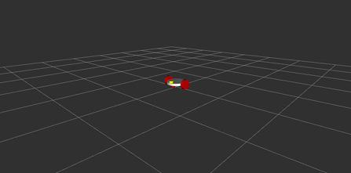
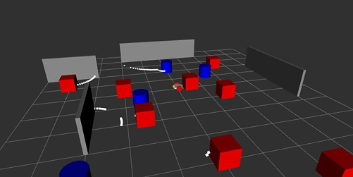
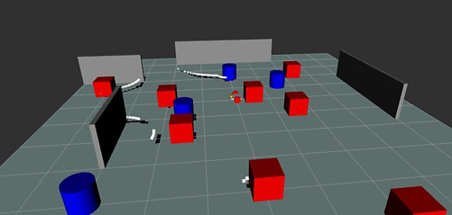
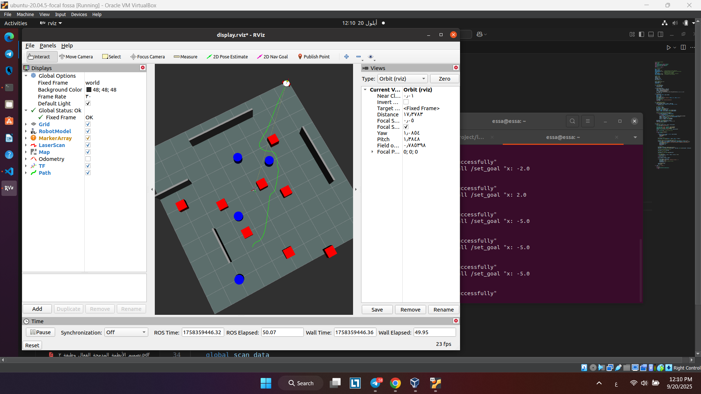

# Autonav_pkg — Autonomous Navigation Demo (ROS)

## Overview
This project demonstrates the **autonomous navigation** of a **differential-drive robot** in a simulated static environment using **ROS (Robot Operating System)**.  
The robot is equipped with a **LiDAR sensor** for real-time obstacle detection and mapping.  

The system integrates several core components:
- **URDF robot model** (differential drive chassis + LiDAR).
- **Simulated environment publisher** (`complex_obstacles` node).
- **LiDAR emulator** that converts published obstacles to `/scan` using TF.
- **Odometry node** that integrates `/cmd_vel` into `/odom` and publishes TF.
- **Occupancy grid map builder** using `/scan` and `/odom`.
- **APF (Artificial Potential Field) controller** for autonomous navigation.
- **Service `/set_goal`** to set navigation targets dynamically.

Navigation and obstacle avoidance are achieved using an **Artificial Potential Field (APF) controller**, which generates:
- **Attractive forces** toward the goal.
- **Repulsive forces** away from obstacles.

This package provides a complete end-to-end pipeline for robotic navigation, making it ideal for **education**, **demonstration**, and as a base for **future robotics research**.

---

## Features / Highlights
- Real-time obstacle avoidance using APF (local planner).
- Occupancy grid mapping and visualization in RViz.
- TF frame publishing for `world` → `body`.
- Simple stuck-recovery routine.
- Modular ROS nodes so components can be swapped/extended.

---

## Results and Discussion
The system successfully demonstrated **obstacle avoidance** and **goal-oriented navigation** within a static simulated environment.  
- The **occupancy grid map** provided clear visualization of free and occupied regions.  
- The **APF controller** ensured smooth trajectory generation and real-time reactions to obstacles.  
- The robot’s path and LiDAR scan data were visualized in **RViz**, allowing real-time monitoring.  

However, as typical with APF-based approaches, challenges such as **local minima** can occur in more complex environments.  

---

## Screenshots  

### 1. Robot Model in RViz  
This image shows the **differential drive robot** URDF model with a mounted **LiDAR sensor**.  
  

---

### 2. Simulated Environment with Obstacles  
The static environment generated by the `complex_obstacles` node, containing various obstacles for the robot to navigate around.  
  

---

### 3. LiDAR Scan Visualization  
Real-time **LiDAR scan data** showing detected obstacles as visualized in RViz.  
  

---

### 4. Occupancy Grid Map  
An **occupancy grid map** generated using LiDAR data and odometry, representing free, occupied, and unknown regions of the environment.  
  

---

### 5. Robot Path Towards Goal  
The robot’s **trajectory** as it moves toward the target location while dynamically avoiding obstacles using the **APF controller**.  
  

---

## Repository Structure


```text
autonav_pkg/
│
├─ package.xml
├─ CMakeLists.txt
├─ README.md
├─ LICENSE
├─ .gitignore
│
├─ launch/
│ └─ autonav.launch
│
├─ rviz/
│ └─ autonav.rviz
│
├─ xacro/
│ └─ differential_robot.xacro
│
├─ srv/
│ └─ SetGoal.srv
│
├─ scripts/
│ ├─ complex_obstacles.py
│ ├─ lidar.py
│ ├─ odom_node.py
│ ├─ map.py
│ ├─ path.py
│ ├─ arduino.py
│ └─ apf_controller.py
│
├─ config/
│ └─ params.yaml
│
└─ docs/
└─ screenshots/
```
---

## Nodes

- complex_obstacles_node — publishes static obstacles as `visualization_msgs/MarkerArray` on `/obstacles`.
- lidar_from_markers_tf — listens to `/obstacles` + `world->body TF` and publishes `/scan` (LaserScan).
- odom_node — subscribes to `/cmd_vel`, integrates motion, publishes `/odom` and `TF`.
- map_builder — subscribes to `/scan` & `/odom` and publishes `/map` (OccupancyGrid).
- apf_controller — subscribes to `/scan` & `/odom`, exposes `/set_goal` service, and publishes `/cmd_vel`.

##  Messages / Services

- Service srv/goal.srv:
```
float64 x
float64 y
---
int32 success
string message
```
---

## How to Run
1. Clone the repository and Make sure you have a catkin workspace and the package is placed in `src/`:
   ```bash
   git clone https://github.com/<your-username>/autonav_pkg.git
   ```
2. Build the package:
 ```bash
  cd ~/catkin_ws
  catkin_make
  source devel/setup.bash
```
3. Launch the simulation:
 ```bash
roslaunch autonav_pkg autonav.launch
```
4. Set a navigation goal:
 ```bash
rosservice call /set_goal "x: 2.0 y: 3.0"
```
---

## Troubleshooting & Notes

- If RViz shows empty map: confirm `/scan` and `/odom` are publishing and TF world->body exists.
- If robot stuck in local minima: APF is a local planner — consider hybrid global planner or randomized escape behavior.
- The odometry here is simulated by integrating `/cmd_vel` (no encoder noise/correction).

## Suggested further work

- Replace local APF with a hybrid planner (global path + local obstacle avoidance).
- Add SLAM (gmapping / Cartographer) for robust localization.
- Plug in real robot hardware by replacing the lidar_from_markers_tf and odom_node with real topics.
---

## License

This project is licensed under the MIT License — see LICENSE for details.

---

## Authors

- Beilassan Hdewa
- Lana Al wazzeh
- Zain Alabidin Shbani
